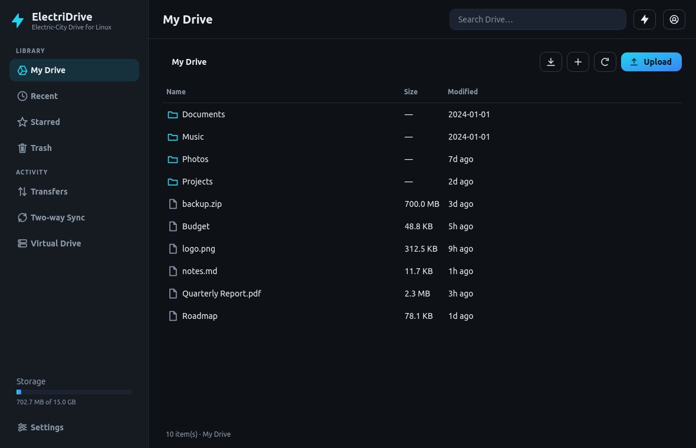
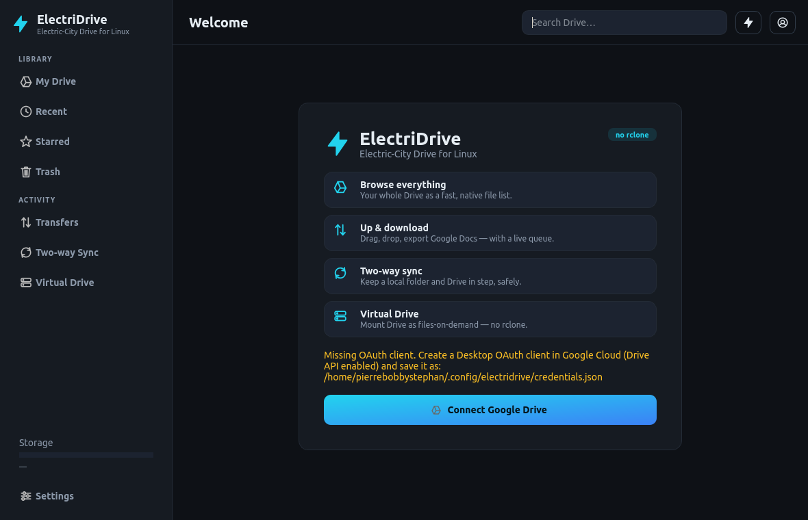
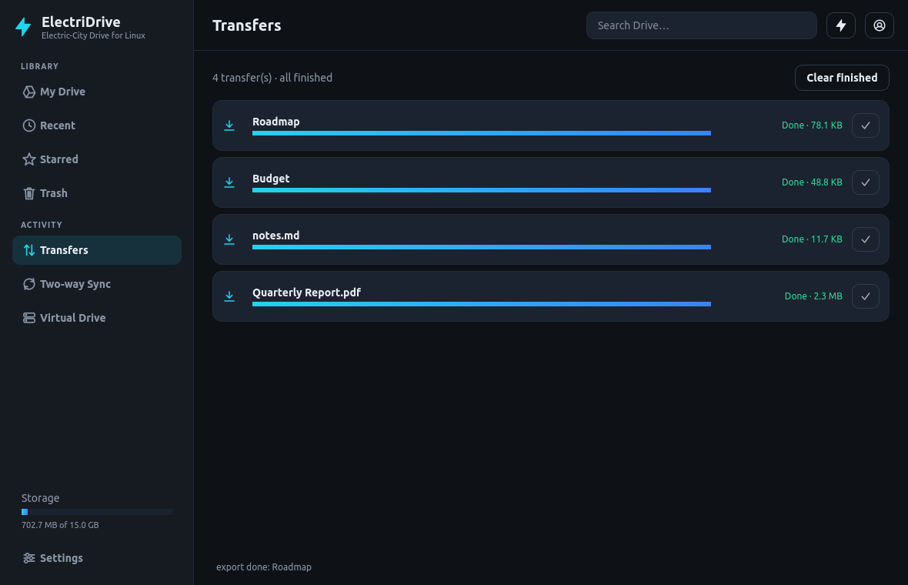
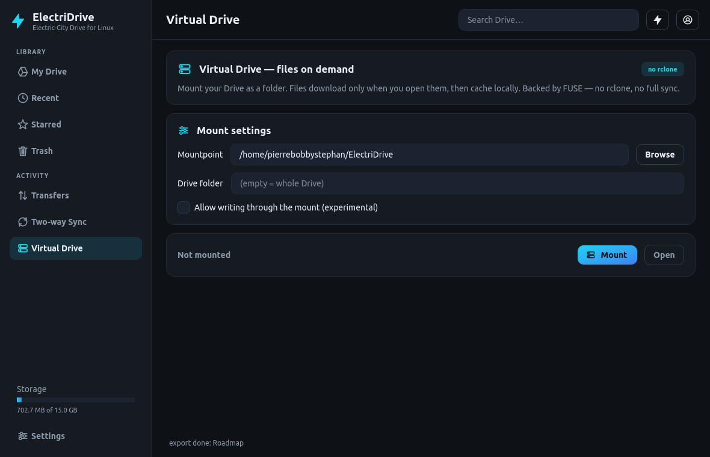

# ⚡ ElectriDrive — Electric-City Drive for Linux

[](https://github.com/ElectriCity-AI-Systems/electri-city-gdrive/releases/latest)
[](https://github.com/ElectriCity-AI-Systems/electri-city-gdrive/releases/latest)


**A beautiful, native, safety-first Google Drive client for Linux — browse, up/download,
two-way sync, and mount Drive as a virtual filesystem. Without rclone.**

ElectriDrive fills a gap that just opened up: GNOME 50 / Ubuntu 26.04 are **removing**
Google Drive from the file manager (the unmaintained `libgdata` integration), and the only
suggested replacements are command-line tools like rclone and `google-drive-ocamlfuse`.
ElectriDrive brings the experience back — with a modern Electric-Dark designer UI.

> ## ⬇️ Get ElectriDrive
> **Just want to use it? Download a ready-to-run build — no Python, no setup.**
> → **[Latest AppImage or .deb](https://github.com/ElectriCity-AI-Systems/electri-city-gdrive/releases/latest)**
> ```bash
> chmod +x ElectriDrive-x86_64.AppImage && ./ElectriDrive-x86_64.AppImage
> # …or:  sudo apt install ./electridrive_2.0.0_amd64.deb
> ```
> Running from source is only for developers — see [Install → Option B](#install).
>
> 💛 Free & open source. If it helps you, **[donate what you want](https://www.paypal.com/donate/?hosted_button_id=SATEMACLEGSTL)** — thank you!



## Features

- **Explorer** — browse the files ElectriDrive can access (everything it created, plus
  anything you grant via **Add from Drive**); Recent, Starred, Trash, breadcrumb
  navigation, multi-select, search.
- **Add from Drive (Google Picker)** — grant access to specific existing files/folders in
  one click. This keeps the app on the privacy-friendly `drive.file` scope, which needs
  **no Google security audit** — so it can be distributed globally.
- **Up & download** — upload files/folders (button or drag & drop), download anything,
  **export Google Docs/Sheets/Slides** to Office formats, all through a live **transfer
  queue** with progress, speed, ETA, cancel & retry.
- **Two-way sync** — keep a local folder and a Drive folder in step using the efficient
  Drive **Changes API**. Conflict-safe: the newer side wins and the other is kept as a
  "(conflict …)" copy. **Deletions are never lost** — they go to Trash.
- **Virtual Drive (FUSE)** — mount Drive as a folder with **files-on-demand**: files
  download only when opened, then cache locally. No rclone.
- **Designer UI** — bespoke Electric-Dark theme (light theme included), crisp vector icons,
  no third-party widget license required.
- **Safety-first** — no permanent deletes in automated flows; everything recoverable via Trash.

| Login / onboarding | Transfers | Virtual Drive |
|---|---|---|
|  |  |  |

## Install

### Option A — download a ready-to-run build (recommended)

Grab the latest **AppImage** or **.deb** from the
[Releases page](https://github.com/ElectriCity-AI-Systems/electri-city-gdrive/releases/latest):

```bash
# AppImage (portable, nothing to install):
chmod +x ElectriDrive-x86_64.AppImage
./ElectriDrive-x86_64.AppImage           # on FUSE3-only systems: ./ElectriDrive-x86_64.AppImage --appimage-extract-and-run

# …or the .deb (installs to /opt + app-menu entry):
sudo apt install ./electridrive_2.0.0_amd64.deb

# optional: verify the download
sha256sum -c SHA256SUMS.txt
```

### Option B — run from source (developers)

```bash
sudo apt update
sudo apt install python3 python3-venv python3-pip libfuse3-3 fuse3 -y   # fuse only for Virtual Drive

git clone https://github.com/ElectriCity-AI-Systems/electri-city-gdrive.git
cd electri-city-gdrive
bash scripts/install_dev.sh              # creates .venv, installs deps, runs tests
source .venv/bin/activate && python app.py
bash scripts/install_desktop.sh          # optional app-menu launcher
```

> Downloaded the source **ZIP** instead of cloning? Unzip it and `cd` into the extracted
> folder (e.g. `electri-city-gdrive-main`) — the project lives at the **root**, there is no
> `electridrive-linux-v1.0` sub-folder. If you hit a "bad interpreter" error, a stale `.venv`
> got moved; run `rm -rf .venv` and re-run `bash scripts/install_dev.sh`.

## Connect Google Drive

**End users (shipped build):** just launch and click **Connect Google Drive** — the app has a
built-in OAuth client (PKCE, loopback), so there is *no* `credentials.json` to create. Use
**Add from Drive** to grant access to existing files/folders.

**Developers / distributors — set up the built-in client once:**
1. In Google Cloud: create a project, enable the **Google Drive API** and **Google Picker API**.
2. Create an **OAuth client of type "Desktop app"**, and a **browser API key** (for the Picker).
3. Configure the consent screen (app name, logo, support email, privacy policy) and publish it
   "In production". `drive.file` is non-sensitive, so this needs only basic verification — **no
   CASA audit**.
4. Give the app the client (any one of):
   - env: `ELECTRIDRIVE_CLIENT_ID=…  ELECTRIDRIVE_CLIENT_SECRET=…  ELECTRIDRIVE_PICKER_API_KEY=…`
   - file: `~/.config/electridrive/app_client.json` (installed-app client JSON)
   - or hard-code them in `electridrive/google_api/app_client.py` for your build.

> **Scopes.** Default is **`drive.file`** (per-file; no audit; global-ready). Power users with
> their **own** OAuth client can opt into full Drive with `ELECTRIDRIVE_SCOPE=drive` (a
> *restricted* scope — needs Google verification + CASA; see "Selling / publishing").
>
> **Power-user override:** dropping your own `~/.config/electridrive/credentials.json` takes
> precedence over the built-in client (useful for self-hosting or full-`drive` testing).

## Run

```bash
source .venv/bin/activate
python app.py            # or: python -m electridrive  (GUI)
```

## CLI

```bash
python -m electridrive.cli doctor                                   # status incl. FUSE availability
python -m electridrive.cli list --limit 20
python -m electridrive.cli download <FILE_ID> ~/Downloads          # file or whole folder (Docs exported)
python -m electridrive.cli sync-up ~/Documents --remote-folder "ElectriDrive/Backup"   # upload-only
python -m electridrive.cli sync ~/Documents --remote-folder "ElectriDrive/Docs"        # two-way
python -m electridrive.cli mount ~/ElectriDrive                     # files-on-demand mount (Ctrl+C to unmount)
python -m electridrive.cli unmount ~/ElectriDrive
```

## Safety model

- Two-way sync **never silently deletes**: a removed remote file is sent to **Drive Trash**;
  a removed local file is moved to a local `.electridrive-trash` folder. Both recoverable.
- Conflicts keep **both** versions (newer wins the canonical name).
- The Virtual Drive is **read-only** by default; writing through the mount is experimental
  and opt-in.
- Default excludes (sync/upload): `.git`, `node_modules`, `__pycache__`, `.venv`, caches,
  temp files, hidden files (configurable).

## Architecture (for contributors)

```
electridrive/
├── google_api/client.py   # Drive v3: list/download/export/upload/changes/about/trash
├── transfers/manager.py   # threaded, Qt-free upload/download queue
├── sync/                  # engine (upload-only), twoway.py (conflict-safe reconciler), downloader/uploader planners
├── vfs/fuse_mount.py      # DriveTree (testable) + fusepy mount (lazy import)
├── ui/                    # Electric-Dark theme, sidebar shell, views (explorer/transfers/sync/vfs/settings)
└── cli.py
```

Heavy dependencies (PySide6, googleapiclient, fusepy) are imported lazily so the core and the
test suite run headless. All Drive access goes through `DriveClientProtocol`, so the engines,
transfer manager and FUSE tree are tested against an in-memory `FakeDrive` (`tests/fakes.py`).

## Development

```bash
python -m pytest -q                                   # full suite (no Google/Qt/FUSE needed)
QT_QPA_PLATFORM=offscreen python -m electridrive      # headless GUI smoke
python scripts/make_icon.py                           # regenerate the app icon
```

## Build for distribution

Ship a self-contained build (bundled Python + PySide6) so users don't install anything.
The OAuth client is **baked in** at build time, so end users just sign in.

```bash
# 1) bake your built-in client into the package (gitignored), from env:
ELECTRIDRIVE_CLIENT_ID=... ELECTRIDRIVE_CLIENT_SECRET=... \
ELECTRIDRIVE_PICKER_API_KEY=... python scripts/bake_client.py

# 2a) AppImage (portable, runs on most distros):
bash scripts/build_appimage.sh        # -> dist/ElectriDrive-x86_64.AppImage

# 2b) .deb (installs into /opt, adds a menu launcher):
bash scripts/build_deb.sh             # -> dist/deb/electridrive_<ver>_amd64.deb
```

Both scripts auto-bake the client if `ELECTRIDRIVE_CLIENT_ID` is set when you run them.
The PyInstaller spec is `packaging/electridrive.spec`. FUSE (Virtual Drive) needs
`libfuse3` on the user's machine (the `.deb` declares it as a dependency).

## Automatic license delivery

For hands-off Pro keys, deploy the PayPal IPN service in `server/` — it verifies each
donation and emails a signed key automatically. See **`server/README.md`**.

## Selling / publishing

Two-tier distribution strategy:

- **Global launch (now): `drive.file` + Picker.** Non-sensitive scope → only **basic** OAuth
  verification, **no CASA audit, no annual fee, unlimited users**. Ship the built-in client and
  you're global. Still required: a privacy policy + Limited-Use disclosure and a configured,
  published consent screen.
- **"Pro" tier (later): full `drive`.** Restricted scope → Google OAuth **verification + CASA**
  security assessment (third-party lab, ~$500–$4,500/year, re-validated annually). Worth it once
  revenue justifies it; unlocks whole-Drive browse/mount/sync (what Insync/rclone do).

### Pricing & licensing (ElectriDrive Pro)

Pro unlocks full-Drive access (whole-Drive browse, sync/mount of existing folders' contents).
ElectriDrive uses a **"pay what you want"** model via PayPal — undercutting every competitor
(overGrive $4.99, Insync $29.99): supporters donate any amount and receive a **license key**.

Activation is **server-less**: keys are Ed25519-signed offline. You keep the private signing key;
the app ships the matching public key and verifies keys with no license server.

```bash
# one-time: create your signing keypair (writes the private key to your config dir,
# prints the public key to embed in electridrive/licensing.py PUBLIC_KEY_B64)
python -m electridrive.licensing keygen

# for each supporter who donates, issue a key and send it to them:
python -m electridrive.licensing issue --name "Jane Doe" --email jane@example.com
```

Supporters click **Support & get Pro** (Settings → *Access & ElectriDrive Pro*; also hinted in
Sync/Virtual Drive), donate, then paste the key into **Activate**. Full-Drive access is gated on a
valid license (or a user-supplied OAuth client) **at runtime**, not just in the UI. Configure the
donate link / price text via env or build constants:

```bash
export ELECTRIDRIVE_PRO_URL="https://www.paypal.com/donate/?hosted_button_id=XXXX"
export ELECTRIDRIVE_PRO_PRICE="Pay what you want"
```

### Google verification & the CASA audit (only for the Pro full-`drive` tier)

The free build uses `drive.file` (non-sensitive) → **no audit, ships globally today**. The Pro tier
uses the restricted `drive` scope, which Google gates behind **CASA** (Cloud Application Security
Assessment):

- **What:** a yearly security assessment against the OWASP ASVS, run via a Google-authorized
  third-party lab (TAC Security, DEKRA, Leviathan, …) that sends Google a Letter of Assessment.
- **Tiers:** most apps need **Tier 2** (self-scan + lab verification); higher-risk apps **Tier 3**
  (manual pentest).
- **Cost/time:** paid to the assessor, ~$500–$4,500/yr (Google charges nothing); **re-done every 12
  months**; budget a few weeks. Also required: a published consent screen, privacy policy and a
  Limited-Use disclosure.
- **Strategy:** stay on `drive.file` for the global free build; pursue CASA for Pro only once
  donations justify the annual cost.

Note: PySide6 is LGPLv3 (fine for commercial use via the pip wheels); the UI uses a **bespoke QSS
theme** to avoid the commercial license of Fluent/Material kits. Under `drive.file`, **Add from
Drive** grants per-*file* access — picking an existing folder does **not** expose its current
contents (verified live); that's a Pro/full-`drive` capability.

## License

MIT — see `LICENSE`. © Pierre Stephan / Electri_C_ity Studios.
